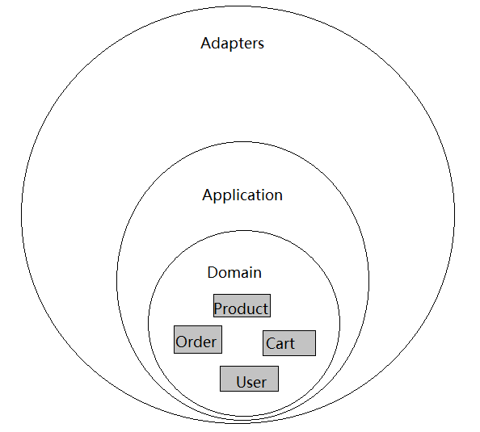
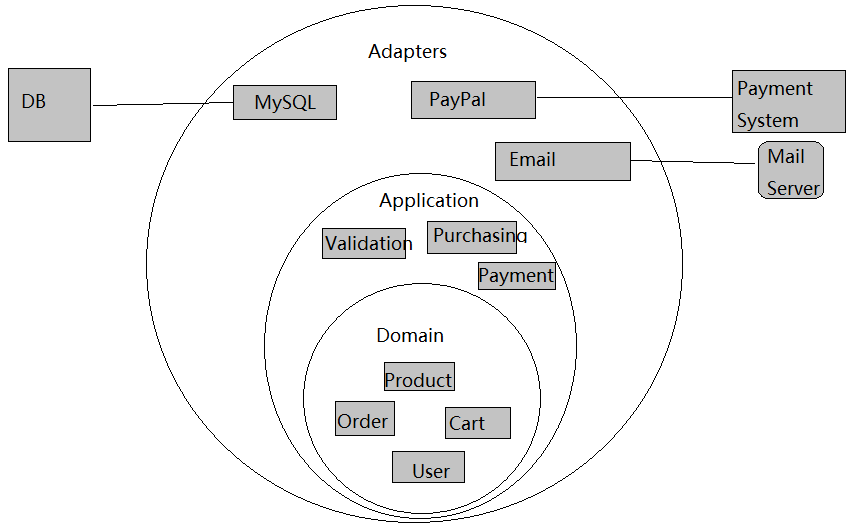
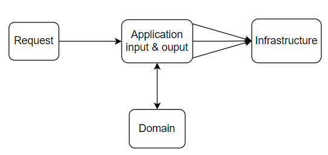

---

## 概要
封面图来自[Get Your Hands Dirty on Clean Architecture](https://reflectoring.io/book/)

[简洁架构](https://blog.cleancoder.com/uncle-bob/2012/08/13/the-clean-architecture.html)是一种软件设计原则，它的目标在于创造易于理解、可维护和可测试的软件系统。它的关注点在于*职责分离*，同时也能够兼容系统的**可扩展性**。

**简洁架构**根据职责分了几个层次，[原文](https://blog.cleancoder.com/uncle-bob/2012/08/13/the-clean-architecture.html)给出了一个突出显示各层的图表：


下面的内容主要是围绕这几个层次展开。而且我们将以用户在商城购物的例子来实现一个用例，来进一步熟悉**简洁架构**。


---


## 简洁架构

**简洁架构**将系统划分为以下几个层次。


### 领域层（Domain Layer）

虽然图中最内层给出的是**实体层（Entities）**，但我认为还应当包含数据转换的部分，所以这一层应当是**领域层**。

**领域层**包含系统的核心业务实体和数据，以及用于转换数据的代码。

**实体层**，你可以认为**实体**是我们在改变一些用例或应用时不会改变的东西。

在商城的案例中，这些实体是产品、订单、用户、购物车，以及增删改查其数据的功能。

将商品添加到购物车的函数并不关心该物品是如何添加的：或是用户自己点击”购买“添加，亦或是通过促销代码自动添加。这两种情况，你都会看到更新商品后的购物车。


### 应用层（Application Layer）

**应用层**包含**用例（Use Cases）**，而用例是每一个业务场景的实现。**用例**用于和**实体层**交互。

例如，”添加到购物车”场景是一个用例。它描述了请求被发送到服务端后应当采取的操作。

对于 `MVC` 架构，**应用层**相当于*控制器层+业务逻辑层*。


### 接口适配器层（Interface Adapters）

**适配器层**是应用层和基础架构的桥梁，它负责将**领域层**的数据格式适配于外部界面的格式，同时也与**基础架构**进行交互。

例如，如果要处理一个请求并响应，就需要**适配器**处理成方便**用例**和**实体**理解的格式（比如 `json`），然后从**实体**和**用例**获取输出，再处理成请求源能够识别的形式。


### 基础架构（Infrastructure）

包含所有的 `I/O` 组件：UI、数据库、框架、设备等，是最易变化的层。


### 依赖规则

**简洁架构**只有一个依赖规则：只有外层可以依赖内层。这意味着：

- 领域必须是独立的
- 用例层依赖实体
- 外层可以依赖任何东西


当然这个规则是可以违反的。我们经常看到在**领域层**依赖第三方库。

但不受控制的依赖关系会导致复杂和混乱的代码，如打破以来规则会导致：

- 循环依赖，模块 A 依赖模块 B，B 依赖 C，C 依赖 A
- 测试性差，必须模拟整个系统来测试一小部分
- 耦合度太高


---


## 简洁架构的优势

- 领域分离

  每个领域的功能是独立，与应用层的耦合度变低，更易维护和测试。

- 独立用例

  应用场景即用例是单独描述的。在用例中可以决定使用哪些第三方服务，即使更换第三方服务，也不会影响到其他层。

- 可替换的三方服务

  由于适配器的存在，更换第三方服务变的简单。只要实现了适配器的接口，即可调用这个服务。


---


## MVC 类比

通常，没有了解过 [`DDD` 领域驱动](https://domain-driven-design.org/zh/ddd-concept-reference.html) 的人都这些层次划分会很模糊，那么做一个 `MVC` 与**简洁架构**的类比会很有帮助：

- 模型（Model）通常对应的是**领域实体**
- 控制器（Controller），通常还会有有个业务逻辑层（Logic），对应的是**应用层**。
- 试图（View）通常对应的是**适配器**

虽然细节上有所不同，但大体类似。这种类比可以快速帮助理解分层的意义。


---


## 应用设计

我们的购物系统与各大商城类似。对于商城的设计，我们只关注主要部分：用户、商品、购物车和订单，而忽略次要部分：登录、校验和操作细节。

想象一下，如果我们要买一副羽毛球拍，需要经历以下步骤：

- 用户加入购物车
- 提交结算
- 生成未支付订单
- 支付完成
- 更新为已支付订单
- 删除购物车


### 设计领域

程序中最重要的是领域，它包含了应用程序的主要实体和数据转换。

商城领域一般包含：

- 实体数据：`user`, `cart`, `order`, `product`
- 数据的转换函数

转换函数只依赖于领域，比如：

- 计算总成本的函数
- 检测产品库存
- 检查是否在购物车中

简要的领域设计如下图




### 设计应用层

**应用层**包含用例。一个用例通常会有一个行为者（actor）或用户、一个动作（action）和一个响应。

在这个商城中，我们可以将应用层区分为以下一个几个用例：

- 商品购买场景
- 调用第三方支付场景
- 查看订单场景

用例通常以主题领域（subject area）的方式描述，其中商品购买场景有以下步骤：

- 从购物车中检索商品并创建一个新的订单
- 订单付款
- 更新订单
- 通知用户
- 清除购物车


### 设计适配器层

适配器的作用是使第三方服务和我们的系统兼容。

在服务端，适配器通常是数据库的连接、支付方式的调用、邮件的通知。




### 系统设计结构

`domain` 是领域层

`application` 是应用层

`services` 是适配器层

结构如下：
```shell
architecture/
|-domain/
  |-cart.go
  |-order.go
  |-user.go
  |-product.go
|-application/
  |-cart.go
  |-interface.go
  |-order.go
  |-orderProduct.go
|-services/
  |-notificationAdapter.go
  |-paymentAdapter.go
```


### 创建领域实体

领域中有 4 个模块：

- 用户
- 产品
- 购物车
- 订单


用户是行为者，用户的实体包括：用户ID、姓名、邮箱等

```go
// domian/user.go
package domain

type User struct {
	ID       int64  `json:"id"`
	Username string `json:"username"`
	Email    string `json:"email"`
}
```


产品包括：产品ID、名称、价格等

```go
// domain/product.go
package domain

type Product struct {
	ID    int64  `json:"id"`
	Name  string `json:"name"`
	Price int64  `json:"price"`
}
```


购物车包括：ID、用户ID、产品信息

```go
// domain/cart.go
package domain

type Cart struct {
	ID       int64     `json:"id"`
	UserID   int64     `json:"user_id"`
	Products []*Product `json:"products"`
}
```


订单包括：订单ID、用户ID、产品信息、状态

```go
// domain/order.go
package domain

type Order struct {
	ID       int64     `json:"id"`
	UserID   int64     `json:"user_id"`
	Products []*Product `json:"products"`
	Status   int64     `json:"status"`
}
```


### 创建数据转换

**注意**：以下只是代码的简写，与业务无关。


购物车实体的 `Contains` 和 `AddProduct` 用于检查物品是否在购物车中和向购物车添加商品。

```go
func (c *Cart) Contains(product Product) (bool, error) {
	for _, p := range c.Products {
		if p.ID == product.ID {
			return true, nil
		}
	}
	return false, nil
}

func GetCart(userID int64) (Cart, error) {
	return Cart{}, nil
}

func (c *Cart) AddProduct(product Product) (bool, error) {
	has, _ := c.Contains(product)
	if has {
		c.Products = append(c.Products, product)
	} else {
		// 有就更新
		for i, p := range c.Products {
			if p.ID == product.ID {
				c.Products[i] = product
			}
		}
	}
	return true, nil
}
```


计算商品列表的总价格

```go
// domain/product.go
func TotalPrice(products []*Product) int64 {
	var totalPrice int64
	for _, product := range products {
		totalPrice += product.Price
	}
	return totalPrice
}
```


创建订单：

```go
// domain/order.go
func CreateOrder(user *User, products []*Product) (Order, error) {
	var order Order
	order.UserID = user.ID
	order.TotalPrice = TotalPrice(products)
	order.Status = 0
	return order, nil
}
```


### 创建应用层

我们已经创建了领域层，接下来可以创建应用层了。

在订单方面，我们需要传递用户信息和产品信息，将两者绑定：

```go
// application/orderProduct.go
package application

import (
	"clean/domain"
)

type OrderProducts func(*domain.User, []*domain.Product) (*domain.Order, error)
```

正常情况下，不应当采用两个单独的参数，而应当将所有的参数封装在内部，这个情况在实际的业务开发中要注意。


购物车方面，在用户执行添加到购物车操作时，有以下步骤：

- 获取购物车
- 检查购车是否已该商品
- 更新购物车

```go
// application/cart.go
func AddToCart(userID int64, productID int64) (bool, error) {
	var product domain.Product
	product.ID = productID

	cart, _ := domain.GetCart(userID)
	_, _ = cart.AddProduct(product)

	return true, nil
}
```


生成一个订单：

```go
func CreateOrder(user *domain.User) (*domain.Order, error) {
	cart, _ := domain.GetCart(user.ID)
	order, _ := domain.CreateOrder(user, cart.Products)

	return &order, nil
}
```


支付和发送通知接口：

```go
// application/interface.go
import "clean/domain"

func Pay(order *domain.Order) {
	services.Pay(order.TotalPrice)
}

func Notify(user *domain.User, message string) {
	services.SendEmail(user.Email, message)
}
```


### 创建适配器

支付服务接口：

```go
// services/paymentAdapter.go
func Pay(price int64) {
	// request Payment Server
}
```


通知服务接口：

```go
// services/paymentAdapter.go
func SendEmail(email, message string) {
	// request Mail Server
}
```


### 数据流程图



用户请求到应用层，应用层会自动调用外部服务。主要逻辑和数据都在领域层中。

所有的外部服务都隐藏在**基础架构**中，如果我们需要修改消息发送方式，只需要修改适配器即可。


---


## 总结

本文介绍了**简洁架构**的分层、与 `MVC` 开发模式的概念替换以及一个基本满足**简洁架构**的应用设计。

实际项目中的情况会更复杂，最主要的问题是我们对领域的了解不足。判断模块属于哪一层非常重要，关注点在于**职责分离**。


本文参考转文：[【译】前端简洁架构](https://juejin.cn/post/7256607606465757243)

---

## 参考：

- [Public Talk about Clean Architecture on Frontend](https://link.juejin.cn?target=https%3A%2F%2Fyoutu.be%2FThgqBecaq_w)
- [Slides for the Talk](https://link.juejin.cn?target=https%3A%2F%2Fbespoyasov.ru%2Ftalks%2Fpodlodka-conf-clean-architecture%2Fen.html)
- [The source code for the application we're going to design](https://link.juejin.cn?target=https%3A%2F%2Fgithub.com%2Fbespoyasov%2Ffrontend-clean-architecture)
- [Sample of a working application](https://link.juejin.cn?target=https%3A%2F%2Fbespoyasov.ru%2Fshowcase%2Ffrontend-clean-architecture%2Fen%2F)

### [设计实践](https://link.juejin.cn?target=https%3A%2F%2Fdev.to%2Fbespoyasov%2Fclean-architecture-on-frontend-4311%23design-in-practice)

- [The Clean Architecture](https://link.juejin.cn?target=https%3A%2F%2Fblog.cleancoder.com%2Funcle-bob%2F2012%2F08%2F13%2Fthe-clean-architecture.html)
- [Model-View-Controller](https://link.juejin.cn?target=https%3A%2F%2Fen.wikipedia.org%2Fwiki%2FModel%E2%80%93view%E2%80%93controller)
- [DDD, Hexagonal, Onion, Clean, CQRS, … How I put it all together](https://link.juejin.cn?target=https%3A%2F%2Fherbertograca.com%2F2017%2F11%2F16%2Fexplicit-architecture-01-ddd-hexagonal-onion-clean-cqrs-how-i-put-it-all-together%2F%23domain-layer)
- [Ports & Adapters Architecture](https://link.juejin.cn?target=https%3A%2F%2Fherbertograca.com%2F2017%2F09%2F14%2Fports-adapters-architecture%2F)
- [More than Concentric Layers](https://link.juejin.cn?target=https%3A%2F%2Fherbertograca.com%2F2018%2F07%2F07%2Fmore-than-concentric-layers%2F)
- [Generating Trees Using L-Systems, TypeScript, and OOP Series' Articles](https://link.juejin.cn?target=https%3A%2F%2Fdev.to%2Fbespoyasov%2Fseries%2F12558)

### [系统设计](https://link.juejin.cn?target=https%3A%2F%2Fdev.to%2Fbespoyasov%2Fclean-architecture-on-frontend-4311%23system-design)

- [Domain Knowledge](https://link.juejin.cn?target=https%3A%2F%2Fen.wikipedia.org%2Fwiki%2FDomain_knowledge)
- [Use Case](https://link.juejin.cn?target=https%3A%2F%2Fen.wikipedia.org%2Fwiki%2FUse_case)
- [Coupling](https://link.juejin.cn?target=https%3A%2F%2Fen.wikipedia.org%2Fwiki%2FCoupling_(computer_programming)) and [cohesion](https://link.juejin.cn?target=https%3A%2F%2Fen.wikipedia.org%2Fwiki%2FCohesion_(computer_science))
- [Shared Kernel](https://link.juejin.cn?target=http%3A%2F%2Fddd.fed.wiki.org%2Fview%2Fwelcome-visitors%2Fview%2Fdomain-driven-design%2Fview%2Fshared-kernel)
- [Analysis Paralysis](https://link.juejin.cn?target=https%3A%2F%2Fen.wikipedia.org%2Fwiki%2FAnalysis_paralysis)

