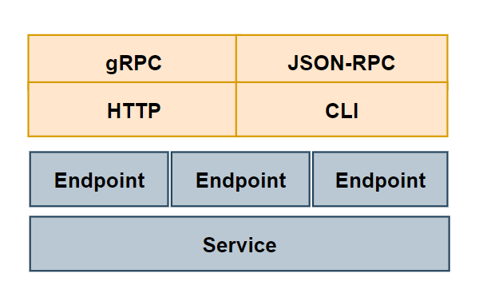
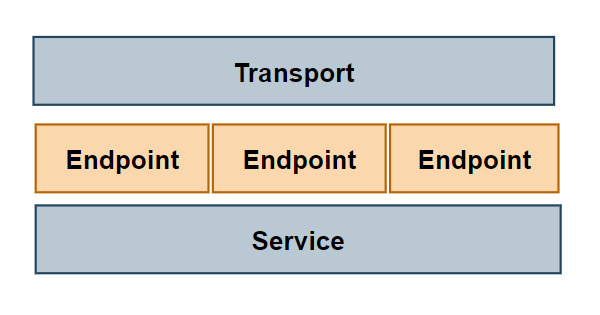
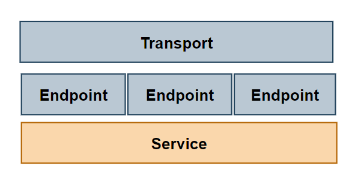

---

## Go-Kit 介绍

Go Kit 并不是一个框架而是一个包的集合。它可以帮助我们构建健壮、可靠、可维护的微服务，这点在生产环境中已得到验证。所以对于想要实现一个简洁架构的 Go 开发者来说，了解 Go Kit 包是非常必要的。


### 关键概念

Go Kit 构建的服务可以分为三层：

- Transport (传输层)
- Endpoint (端点层)
- Service (服务层)


**Transport**



通信协议：提供多种传输协议的支持，包括 HTTP、gRPC、JSON-RPC、CLI 等。

数据编码：负责将数据在服务之间进行编码和解码。不同的通信协议需要不同的编解码方式。


**Endpoint**



端点：是 `Service` 层的入口，对 `Service` 进行 wrapper。它是定义输入和输出定义用例的地方，用简洁架构术语来说，就是处理请求->调用 `Service`->返回响应。

> *请注意，端点是一个接收请求并返回响应的函数，它们都是 interface{}，即 `RequestModel` 和 `ResponseModel`。理论上它也可以用类型参数（泛型）来实现。*
[config](..%2F..%2F..%2F.git%2Fconfig)
中间件：通过一组中间件来组合和包装端点，实现例如日志记录、认证、限流等功能


**Service**



`Service` 层是实现所有业务逻辑的地方。服务不了解端点，端点和服务都不了解传输域。

`Service` 有多个 `Endpoint` 组成，每个 `Endpoint` 代表了一个具体功能。


---


## 简单示例

我们通过一个简单的微服务示例来加深对 Go-Kit 的理解。

假设我们要完成一个打招呼的功能，具体源码可以看 [Go-Kit http 微服务示例](https://gitee.com/snitso/simple-go-micro/tree/main/app/kit/sample)。

文件结构如下：

```shell
|-sample
  |-endpoint/
    |-endpoint.go
  |-service/
    |-service.go
  |-transport/
    |-transport.go
  |-go.mod
  |-main.go
```

- endpoint: 端口层
- service: 业务逻辑层
- transport: 传输层


### 服务层

服务层的代码非常简单：

```go
package service

type IServer interface {
    Hello(name string) string
    Bye(name string) string
}

type Server struct {
}

func (s Server) Hello(name string) string {
    return "Hello " + name
}

func (s Server) Bye(name string) string {
    return "Bye " + name
}
```

如 Go Kit 所建议的，第一步是为我们的服务创建一个接口，接口有 2 个方法 `Hello()` 和 `Bye()` 。`Server` 结构体实现了这个接口。

另外，从这里我们可以看出，一个服务是可以有多个端点的，端点的代码稍后展示。


### 端点层

服务层定义了 `Hello()` 和 `Bye()` 两个方法，如果要调用这两个方法，我们需要创建两个端点。

```go
package endpoint

import (
    "context"
    "sample/service"

    "github.com/go-kit/kit/endpoint"
)

// Package
// Imports
// Types
// Constants AND Var
// Type Methods

// type Endpoint func(ctx context.Context, request interface{}) (interface{}, error)

type HelloRequest struct {
    Name string `json:"name"`
}

type HelloResponse struct {
    Msg string `json:"msg"`
}

type ByeRequest struct {
    Name string `json:"name"`
}

type ByeResponse struct {
    Msg string `json:"msg"`
}

func MakeHelloEndpoint(s service.IServer) endpoint.Endpoint {
    return func(ctx context.Context, request interface{}) (interface{}, error) {
        req := request.(HelloRequest)
        msg := s.Hello(req.Name)
        return HelloResponse{Msg: msg}, nil
    }
}

func MakeByeEndpoint(s service.IServer) endpoint.Endpoint {
    return func(ctx context.Context, request interface{}) (interface{}, error) {
        req := request.(ByeRequest)
        msg := s.Bye(req.Name)
        return ByeResponse{Msg: msg}, nil
    }
}
```

`endpoint.go` 文件中，我们分别定义了 `Hello` 和 `Bye` 的请求体和返回响应体。

同时我们也定义了 `MakeHelloEndpoint()` 和 `MakeByeEndpoint()` 两个函数，目的是将传输层的请求体转为服务层能够识别的结构体，并返回响应。

端点层对传输层一无所知，无论是哪种传输协议，都没有区别。


`endpoint.Endpoint` 定义如下：

```go
type Endpoint func(ctx context.Context, request interface{}) (response interface{}, err error)
```


### 传输层

在这一层中，我们可以有多种实现，如 HTTP, gRPC, AMPQ 等。

```go
package transport

import (
    "context"
    "encoding/json"
    "net/http"
    "sample/endpoint"
)

func HelloRequestDecoder(_ context.Context, r *http.Request) (interface{}, error) {
    var request endpoint.HelloRequest
    err := json.NewDecoder(r.Body).Decode(&request)
    return request, err
}

func HelloResponseEncoder(_ context.Context, w http.ResponseWriter, response interface{}) error {
    w.Header().Set("Content-Type", "application/json")
    return json.NewEncoder(w).Encode(response)
}

func ByeRequestDecoder(_ context.Context, r *http.Request) (interface{}, error) {
    var request endpoint.ByeRequest
    err := json.NewDecoder(r.Body).Decode(&request)
    return request, err
}

func ByeResponseEncoder(_ context.Context, w http.ResponseWriter, response interface{}) error {
    w.Header().Set("Content-Type", "application/json")
    return json.NewEncoder(w).Encode(response)
}
```

`transport.go` 文件分别定义了 `Hello` 和 `Bye` 的请求和响应的编解码函数。

目的是将传输层中的数据解析到端点层的结构体，将从端点层返回的结构体解析到传输层。


### main

`main.go` 文件中，我们将使用所有层：

```go
package main

import (
    "fmt"
    "net/http"
    "sample/endpoint"
    "sample/service"
    "sample/transport"
    "time"
    
    httpTransport "github.com/go-kit/kit/transport/http"
)

func main() {
    s := service.Server{}
    
    // 调用端点层
    hello := endpoint.MakeHelloEndpoint(s)
    bye := endpoint.MakeByeEndpoint(s)
    
    // 实例化 http 服务
    helloServer := httpTransport.NewServer(
        hello,
        transport.HelloRequestDecoder,
        transport.HelloResponseEncoder,
    )
    byeServer := httpTransport.NewServer(
        bye,
        transport.ByeRequestDecoder,
        transport.ByeResponseEncoder,
    )
    
    // 开启 2 个协程监听端口 hello 和 bye 服务
    go func() {
        err := http.ListenAndServe(":8081", helloServer)
        if err != nil {
            panic(err)
        }
    }()
    go func() {
        err := http.ListenAndServe(":8082", byeServer)
        if err != nil {
            panic(err)
        }
    }()
    
    for {
        time.Sleep(time.Second)
        fmt.Println(11111)
    }
}
```


### 运行

```shell
$ curl -s -XPOST -d'{"name": "Anna"}' localhost:8080/hello
{"msg":"Hello Anna"}
$ curl -s -XPOST -d'{"name": "Anna"}' localhost:8080/bye
{"msg":"Bye Anna"}
```


参考：[Microservices in Go using the Go kit](https://dev.to/eminetto/microservices-in-go-using-the-go-kit-jjf)