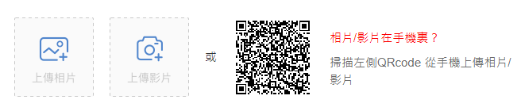
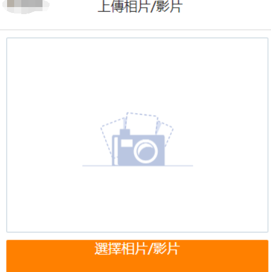
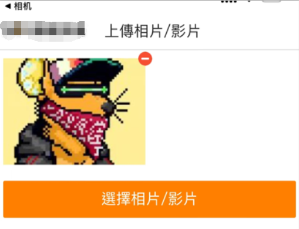
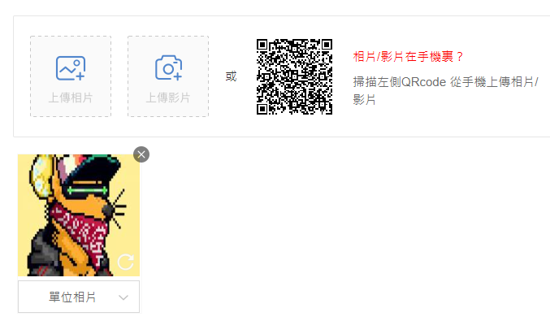
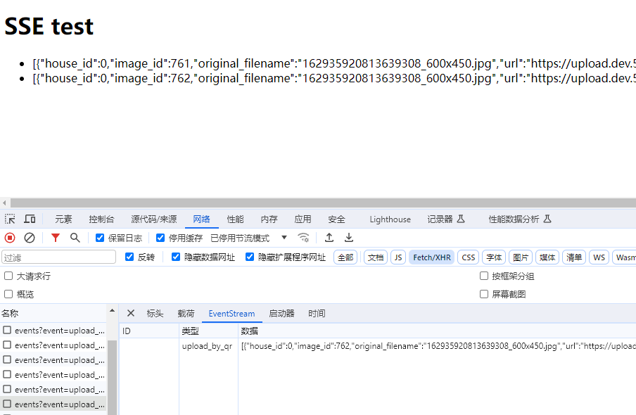

---

`WebSocket` 提供了全双工通道形式，允许服务器和客户端之间进行双向通信。这意味着不但客户端可以向服务端发送消息，同时服务端也可以向服务器发送消息。

`WebSocket` 通常用于

- 实时聊天工具
- 实时游戏
- 实时协作工具
- ......

但对于很多 web 程序来说，`WebSocket` 可能过大。比如，客户端需要实时更新会员中心页的通知数量，不需要双向通信。这时，只需要由服务端向客户端发送消息即可，这个技术就是：`SSE`。

---

## 什么是 SSE

`SSE(Server-Sent Events)`使用的是基于 HTTP 的协议。严格来讲，HTTP 协议是无法做到服务器主动推送消息的。但凡事都有例外，就是服务器向客户端声明发送的是数据流。

```text
Content-Type:text/event-stream
```

也就是说，服务端发送的并不是一次性的数据包，而是不间断的数据流。只要有数据，服务端会源源不断的向客户端发送数据，直到客户端关闭连接。

这种通信是以流的形式来通信，视频播放即是这种形式。

`SSE` 利用这种机制向浏览器推送消息。目前除了IE浏览器，基本上所有的浏览器都支持。

---

## 与 WebSocket 的区别

- `SSE` 提供单向通信，`WebSocket` 提供双向通信
- `SSE` 基于 HTTP 协议，`WebSocket` 基于单独的协议（WebSocket 协议）
- `SSE` 只能传输文本，`WebSocket` 支持二进制和文本传输
- `SSE` 不支持通信加密，`WebSocket` 支持加密通信（TLS/SSL）
- `SSE` 有最大连接数限制，`WebSocket` 协议本身吴最大连接数的限制
- `SSE` 支持重连，`WebSocket` 需要自己实现

---

## SSE 的特点

- 通过单个 HTTP 长连接推送消息，无需轮询
- 使用轻量级的文本格式（`JSON`）,减少不必要的资源消耗
- 浏览器普遍支持
- 实现简单

---

## 数据格式


### 请求头

服务端向浏览器发送的 `SSE` 数据，必须是 `UTF-8` 编码的文本，必须包含以下 HTTP 请求头：

```text
Content-Type: text/event-stream
Cache-Control: no-cache
Connection: keep-alive
```


### 消息体

`SSE` 的消息体格式如下：

```text
[field]: [value]\n
```

field 可以是以下四个值：

- id
- event
- data
- retry


**id 字段**

id 相当于每一条数据的编号。

```text
id: 123124\n
```

如果发生断连，浏览器会将 id 放到 `Last-Event-Id` 中进行重连来作为以重简单的同步机制。


**event 字段**

event 表示自定义的事件类型，如果忽略，默认是 `message` 。浏览器可以用 `addEventListener()` 来监听该事件。

```text
event: foo\n
data: a foo event\n\n

data: a default event\n\n
```

以上代码实现了 2 条信息。

第一条的事件名称是 `foo`，第二条没有指定事件，触发浏览器的 `message` 事件。


**data 字段**

消息数据，以文本的形式发送。格式：

```text
data: hello world\n\n
```

如果以 `\n\n` 为结尾，表示一条完整的数据消息。

多行数据可以以 `\n` 为结尾，如下发送一条 JSON 数据：

```text
data: {\n
data: "name": "张三",\n
data: "age", 25\n
data: }\n\n
```


**retry 字段**

服务端可以用 `retry` 来指定浏览器重新发起连接的时间间隔。单位毫秒

```text
retry: 2000\n
```

以上代码表示浏览器间隔 2 秒重新发起连接。

如果 `retry` 的值不是整数，则会被忽略。

浏览器会发起重连的原因：

- 时间间隔到期
- 网络错误

---

## SSE 实战

接下来我们完成一个简单示例来进一步了解 `SSE` 的用法。


用户在刊登楼盘的时候，需要上传跟楼盘相关的图片。

用户一般是用手机拍摄的图片，如果要求从 PC 浏览器上传，就需要用户从手机端将图片传输到 PC，这就增加了用户的工作量，会让用户感到很不方便。

于是，我们需要实现一个功能，使用户能够从手机端上传图片，同时 PC 浏览器也能同步显示用户上传的图片。


### 具体流程

1、用户进入刊登页面，显示上传图片二维码



2、用户用手机照相机扫二维码后，会跳转到手机浏览器



3、用户在手机浏览器上传图片



4、PC 浏览器端同步显示该图片




### 服务端实现

服务端我们用 Go 语言，kratos 框架实现，。


定义支持 `SSE` 的 header 头：

```go
// 設置頭部，告訴瀏覽器這是一個 SSE 流
w.Header().Set("Content-Type", "text/event-stream")
w.Header().Set("Cache-Control", "no-cache")
w.Header().Set("Connection", "keep-alive")
```


实例化一个 `messageChan` 的通道变量。向客户端发送的消息将通过此通道传递。

```go
// 建立一個消息通道
messageChan := make(chan string, 1)
```


创建一个协程，向 `messageChan` 通道中发送数据

```go
go func () {
    timeout := time.After(30 * time.Minute)
    defer func() {
        // 關閉消息通道
        close(messageChan)
        messageChan = nil
    }()
    
    for {
        images, err := s.imageUC.GetImagesByIdentifier(ctx, memberID, identifier)
        if err != nil {
            s.logger.Errorf("getImages error: %v", err)
            return
        }
        if images == nil {
            return
        }
        
        var buf bytes.Buffer
        _ = json.NewEncoder(&buf).Encode(images)
        
        select {
        case messageChan <- buf.String():
        case <-timeout:
            return
        }
        time.Sleep(time.Second)
    }
}
```


循环读取通道中的数据，`messageChan` 持续等待并接收数据。如果消息可用，那么它将写入到 `http.ResponseWriter` 中，同时刷新消息。

如果客户端关闭连接，`Context().Done()` 会给出一个关闭信号，我们就可以退出循环（退出函数）。

```go
flusher, _ := w.(kratosHttp.Flusher)

for {
    select {
    case message, ok := <-messageChan:
        if !ok {
            return nil
        }
        // 向客戶端發送事件
        event = fmt.Sprintf("event: %s\n", event)
        message = fmt.Sprintf("data: %s\n", message)
        retry := "retry: 2000\n"
        _, _ = fmt.Fprintf(w, "%s%s%s\n", event, retry, message)
        flusher.Flush()
    case <-ctx.Request().Context().Done():
        return nil
    }
}
```


完整代码如下：

```go
// RegisterSSESvcServers register SSE.
func RegisterSSESvcServers(s *kratosHttp.Server, srv *SSEService) {
    s.Route("/v1").GET("/api/sse/events", srv.events)
}

func (s *SSEService) events(ctx kratosHttp.Context) error {
    r := ctx.Request()
    w := ctx.Response()
    memberID, err := strconv.ParseUint(r.URL.Query().Get("member_id"), 10, 32)
    if err != nil {
        _ = JsonRes(constant.StatusParamError, "請傳遞member_id")(w, r, nil)
        return nil
    }
    identifier := r.URL.Query().Get("identifier")
    if identifier == "" {
        _ = JsonRes(constant.StatusParamError, "請傳遞identifier")(w, r, nil)
        return nil
    }
    event := r.URL.Query().Get("event")
    if event == "" {
        _ = JsonRes(constant.StatusParamError, "請傳遞event")(w, r, nil)
        return nil
    }
    
    // 建立一個消息通道
    messageChan := make(chan string, 1)
    go s.getMessage(ctx, messageChan, uint32(memberID), identifier)
    
    // 設置頭部，告訴瀏覽器這是一個 SSE 流
    w.Header().Set("Content-Type", "text/event-stream")
    w.Header().Set("Cache-Control", "no-cache")
    w.Header().Set("Connection", "keep-alive")
    // 準備 flusher
    flusher, _ := w.(kratosHttp.Flusher)
    
    for {
        select {
        case message, ok := <-messageChan:
            if !ok {
                return nil
            }
            // 向客戶端發送事件
            event = fmt.Sprintf("event: %s\n", event)
            message = fmt.Sprintf("data: %s\n", message)
            retry := "retry: 2000\n"
            _, _ = fmt.Fprintf(w, "%s%s%s\n", event, retry, message)
            flusher.Flush()
        case <-ctx.Request().Context().Done():
            return nil
        }
    }
}

func (s *SSEService) getMessage(
    ctx kratosHttp.Context,
    messageChan chan<- string,
    memberID uint32,
    identifier string,
) {
    timeout := time.After(30 * time.Minute)
    defer func() {
        // 關閉消息通道
        close(messageChan)
        messageChan = nil
    }()
    
    for {
        images, err := s.imageUC.GetImagesByIdentifier(ctx, memberID, identifier)
        if err != nil {
            s.logger.Errorf("getImages error: %v", err)
            return
        }
        if images == nil {
            return
        }
    
        var buf bytes.Buffer
        _ = json.NewEncoder(&buf).Encode(images)
    
        select {
        case messageChan <- buf.String():
        case <-timeout:
            return
        }
        time.Sleep(time.Second)
    }
}
```


### js 实现

```html
<!DOCTYPE html>
<html>
<head>
    <title>SSE test</title>
    <script type="text/javascript">
        window.addEventListener("DOMContentLoaded", function () {
            var evsrc = new EventSource("http://go.dev.591.com.hk:8084/v1/api/sse/events?event=upload_by_qr&member_id=1&identifier=efabcoxe");
            evsrc.addEventListener("upload_by_qr", function (ev) {
                console.log("Received upload_by_qr event: " + ev.data);
                document.getElementById("log").insertAdjacentHTML("beforeend", "<li>" + ev.data + "</li>");
            });

            evsrc.onerror = function (ev) {
                console.log("readyState = " + ev.currentTarget.readyState);
            };
        })
    </script>
</head>
<body>
<h1>SSE test</h1>
<div>
    <ul id="log">
    </ul>
</div>
</body>
</html>
```


### SSE 测试

1、启动服务

```shell
INFO ts=2024-01-23T14:18:47+08:00 caller=http/server.go:317 service.id=addcn-taiwan.meta.juicefs.io service.name=house_release service.version= trace.id= span.id= msg=[HTTP] server listening on: [::]:8084
INFO ts=2024-01-23T14:18:47+08:00 caller=grpc/server.go:212 service.id=addcn-taiwan.meta.juicefs.io service.name=house_release service.version= trace.id= span.id= msg=[gRPC] server listening on: [::]:9094
```


2、访问 html 页面

